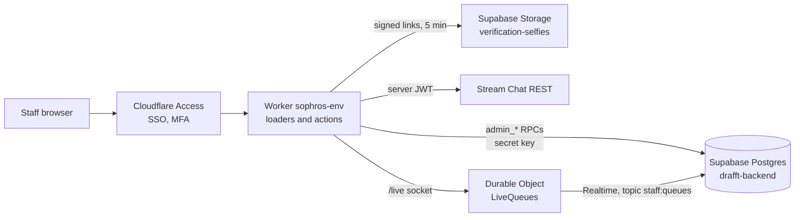

<div align="center">


The drafft team's moderation and support dashboard.<br>
Accounts, holds and bans, selfie checks, reports, photo reviews, support requests, and the audit trail of it all.

[](https://github.com/sylwaninn/drafft-sophros/actions/workflows/ci.yml)
[](https://github.com/sylwaninn/drafft-sophros/actions/workflows/pr.yml)


</div>

## How it works

A React Router app (framework mode, server-rendered) on Cloudflare Workers, Tailwind 4. One Worker per
environment, reachable only on its custom domain behind Cloudflare Access. sophros stores nothing itself:
every read and change goes through drafft-backend.



### Every request

1. **Access.** The Worker reads the Access token (`cf-access-jwt-assertion` header or `CF_Authorization`
   cookie) and verifies it against the team's keys: issuer, audience (`ACCESS_AUD`), RS256, expiry. A missing
   or invalid token gets a 401.
2. **Staff.** `admin_whoami(email)` returns the person's role in this environment's database; no role, a 403.
3. **Origin.** A form post from another origin gets a 403.
4. **Headers.** HTML gets a Content-Security-Policy with a fresh nonce; every response gets `DENY` framing, no
   referrer, `noindex`, HSTS and `private, no-store`.

Locally, `AUTH_MODE=dev` replaces step 1 with `DEV_STAFF_EMAIL`, on localhost only; step 2 still applies.

### Reading and acting

- **Reads.** Each page's loader calls `admin_*` functions through PostgREST with the secret key, which never
  reaches the browser. The signed-in email is always passed as `p_actor`, last, so no field can replace it.
- **Changes.** One action endpoint, `/act`, maps each form's `intent` to an `admin_*` function (holds,
  photo decisions, reports, support replies, notes, staff, failed events, account deletion). A decision the
  member is told about needs a reason category from `admin_reason_categories` and a note within the length
  limit, checked here and again by the database.
- **Roles.** The interface hides what a role can't do; the database decides. Each `admin_*` function checks the
  role, refuses with `forbidden` (a 403 page here) and writes the audit log.

### Sensitive reads

| Read             | Flow                                                                                                                                                                                                                                                                    |
| ---------------- | ----------------------------------------------------------------------------------------------------------------------------------------------------------------------------------------------------------------------------------------------------------------------- |
| Conversation     | `admin_conversation_access` shows the basis (a report, a help request, a hold) without reading anything. The person types a reason; `admin_log('conversation.view')` records it on both accounts; then the Worker reads the match's Stream channel (80 messages a page) |
| Message deletion | `admin_log('message.delete')` with a reason category, then Stream's delete                                                                                                                                                                                              |
| Selfie           | a typed reason; `admin_selfies` logs `selfie.view`; Storage signs a 5-minute link                                                                                                                                                                                       |
| Photo or video   | `/media/<key>` answers a redirect to a signed link of the media Worker (HMAC-SHA256, valid at least an hour)                                                                                                                                                            |

### Live counters

One Durable Object per environment holds a single Supabase Realtime connection on the private topic
`staff:queues`. Browsers connect to it through `/live` (same origin, Access and role checked); each queue change
makes the open page read again. A browser socket closes after an hour, so Access and the role are checked again
on reconnect. Queue counters are also read again after every action, and on navigation once a minute old.

## Roles

Each role has the rights of the one before.

| Role        | Can                                                                                                                        |
| ----------- | -------------------------------------------------------------------------------------------------------------------------- |
| `support`   | accounts, support requests, reports and photo queue (read), notes, mark requests handled and exports sent                  |
| `moderator` | holds (review, selfie, ban), photos, flagged media, reports, conversations, selfies, sign-out everywhere, message deletion |
| `admin`     | lifting a ban, staff, the whole audit log, failed events, deleting an account at the member's request                      |

## Pages

| Page             | What for                                                                                                                               |
| ---------------- | -------------------------------------------------------------------------------------------------------------------------------------- |
| Queues           | every queue with its size and oldest case; accounts on hold                                                                            |
| Accounts         | search by name, email, phone or id; filter held, flagged, reported, tempo                                                              |
| Account          | everything about one account (profile, devices, holds, reports, matches, purchases, support, notes, staff trail) and the actions on it |
| Verifications    | selfie next to the profile photos: lift, ask again, ban                                                                                |
| Reports          | open reports with both people and their conversation; close, with an optional hold                                                     |
| Support          | requests from the help forms and the support address, with their thread; replies emailed by the backend                                |
| Profile photos   | pending photos and automatic refusals, one by one                                                                                      |
| Shared media     | chat photos the silent check flagged; act on the sender                                                                                |
| Conversations    | every match, filtered; open one with its basis and a reason                                                                            |
| Failed events    | side effects the backend gave up on: replay or discard                                                                                 |
| Audit log, Staff | admins                                                                                                                                 |

## Getting started

Runs against the local Supabase of drafft-backend, whose migrations hold the `admin_*` functions.

```sh
(cd ../drafft-backend && supabase start)   # a db reset seeds dev@drafft.local as admin
pnpm install
scripts/local-env.sh                       # writes .dev.vars (local service role key)
pnpm dev                                   # http://localhost:5173
```

Locally `AUTH_MODE=dev` signs you in as `DEV_STAFF_EMAIL` without Access; the Worker refuses that mode outside
`local` and off localhost. Conversations need the Stream staging key and secret in `.dev.vars`. Actions here
really happen on the database the **Drafft Local** apps use.

`scripts/demo.sh up` adds 14 local accounts covering every case (a ban and a new account on the same phone, a
selfie to compare, reports, flagged chat photos, support requests); `scripts/demo.sh down` removes them.

| Command       | What                                            |
| ------------- | ----------------------------------------------- |
| `pnpm verify` | types, lint, format, tests, build: what CI runs |
| `pnpm format` | fix formatting                                  |

## Deploy

| When                            | CI (`.github/workflows/ci.yml`)                                                                                                                  |
| ------------------------------- | ------------------------------------------------------------------------------------------------------------------------------------------------ |
| Pull request into `staging`     | title format; types, ESLint, Prettier, tests, build; Worker bundle for both environments; `pnpm audit`, gitleaks, actionlint, zizmor, shellcheck |
| Merge into `staging`            | the same checks, then deploy `sophros-staging`                                                                                                   |
| Release (**Actions > release**) | `main` fast-forwards to `staging`, a `vX.Y.Z` tag, then deploy `sophros-production` from the tag                                                 |

After each deploy, a smoke test requires the domain to redirect to Access: a page served without it fails the
run. Deploys run from GitHub Actions only. Access setup, staff, secrets and rollback:
[docs/deployment.md](docs/deployment.md).

## Documentation

| Document                                         | Read it when you                                                                   |
| ------------------------------------------------ | ---------------------------------------------------------------------------------- |
| [docs/moderation.md](docs/moderation.md)         | touch a decision the member is told about, a sensitive read or an account deletion |
| [docs/deployment.md](docs/deployment.md)         | set up an environment, a secret or a deploy                                        |
| [PRODUCT.md](PRODUCT.md), [DESIGN.md](DESIGN.md) | need the users and the interface rules                                             |
| [AGENTS.md](AGENTS.md)                           | run a coding agent, or need the repository rules                                   |

A new capability starts in drafft-backend, with an `admin_*` function, its role check and its audit line,
then a page here.

## Related repositories

| Repository                                                    | Role                                                    |
| ------------------------------------------------------------- | ------------------------------------------------------- |
| [drafft-backend](https://github.com/sylwaninn/drafft-backend) | the `admin_*` functions, moderation and retention rules |
| [drafft-ios](https://github.com/sylwaninn/drafft-ios)         | iPhone app                                              |
| [drafft-android](https://github.com/sylwaninn/drafft-android) | Android app                                             |
| [drafft-web](https://github.com/sylwaninn/drafft-web)         | getdrafft.com and the legal pages                       |

## License

Proprietary. Copyright © 2026 the drafft authors. All rights reserved. No permission is granted to use, copy,
modify or distribute this code without written consent.
